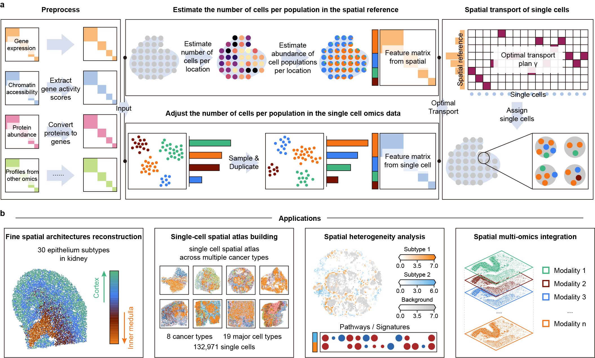

# scPositioner v1.1.0

## Global optimal-based spatial mapping of single-cell multi-omics

[](https://www.python.org/) [](https://doi.org/10.5281/zenodo.13161096)

scPositioner is a computational method to map single cells into spatial context and integrate multi omics




### Create and activate conda environment with requirements installed.
For scPositioner, the Python version need is over 3.9. If you have already installed a lower version of Python, consider installing Anaconda, and then you can create a new environment.
```
cd scPositioner-main

conda env create -f environment.yml -n scpositioner
conda activate scpositioner
```

### Install scPositioner
```
python setup.py build
python setup.py install
```

## Tutorials (single cell spatial mapping)

scPositioner requires single-cell omics data, where cell type label of each cell needs to be provided; 
                  and spatial reference (both stored as `.h5ad` format) as input.
 
### For spot-level SRT datasets, scPositioner requires cell-type composition of each spot (deconvolution results).

(Optional) If you don't have cell-type composition of each spot, consider running [cell2location](https://github.com/BayraktarLab/cell2location) first.

(Optional) Here is an example of [running cell2location](tutorial/tutorial_runcell2location.ipynb).

(Optional) You can install both cell2location and scPositioner in the same virtual environment. scPositioner will automatically run cell2location when no deconvolution results are provided.

Here is an example of scPositioner on spot-level SRT reference (10X Visium):
* [Demonstration of scPositioner on the spot-level data](tutorial/tutorial_kidney.ipynb)

### For single-cell SRT datasets, scPositioner requires cell type label of each cell.
An example of scPositioner on single-cell SRT reference (10X Xenium):
* [Demonstration of scPositioner on the single-cell data](tutorial/tutorial_XeniumBC.ipynb)

### scPositioner provides tutorials to convert data from other omics into gene-associated features. 
* [Convert proteins names into gene names](tutorial/tutorial_protein2genes.R)
* [Convert ATAC fragments into gene activity score matrix](tutorial/tutorial_ATACfragments_to_genes.R)
### and an example of scPositioner on multi-omics datasets.
* [Demonstration of scPositioner on multi-omics data](tutorial/tutorial_intestine.ipynb)

### For readers concerned with mapping confidence, scPositioner provides a dedicated module and tutorial to evaluate the stability of each mapping.
* [Mapping confidence evaluation](tutorial/tutorial_StabilityAnalysis.ipynb)


## About
scPositioner is developed by Jingyang Qian and Hudong Bao. Should you have any questions, please contact Hudong Bao at baohd@zju.edu.cn.

